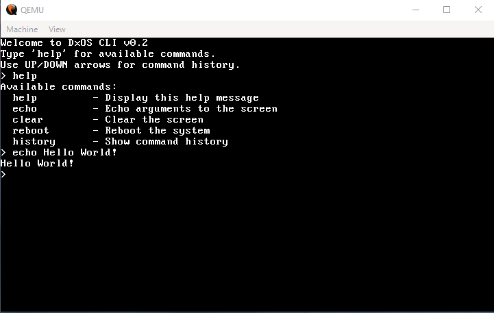

# DxOS

A minimal x86-64 operating system written in Rust, built from scratch without relying on the standard library.



## Features

### Current Functionality (v0.2)

- **VGA Text Mode Display** - Direct VGA buffer manipulation for terminal output
- **Keyboard Input** - PS/2 keyboard support with scancode decoding
- **Command Line Interface** - Basic shell with command history (UP/DOWN arrows)
- **Exception Handling** - Complete IDT (Interrupt Descriptor Table) with handlers for:
  - Breakpoint exceptions
  - Double faults (with dedicated stack via TSS)
  - Page faults
  - General protection faults
- **Memory Protection** - GDT (Global Descriptor Table) with TSS for safe fault handling
- **Built-in Commands**:
  - `help` - Display available commands
  - `clear` - Clear screen
  - `echo <text>` - Print text to screen
  - `reboot` - Restart the system

### Technical Details

- **Language:** Rust (no_std, no_main)
- **Target:** x86-64 bare metal
- **Bootloader:** bootimage (v0.9)
- **Input Method:** Keyboard polling (interrupt-driven support in development)
- **Display:** 80x25 VGA text mode at 0xb8000

## Building

### Prerequisites

```bash
# Install Rust nightly toolchain
rustup override set nightly

# Install bootimage tool
cargo install bootimage

# Add rust-src component
rustup component add rust-src

# Install LLVM tools
rustup component add llvm-tools-preview
```

### Build and Run

```bash
# Build the OS
cargo build --target x86_64-blog_os.json

# Run in QEMU
cargo run --target x86_64-blog_os.json
```

## Project Structure

```
DxOS/
├── src/
│   ├── main.rs           # Entry point and main loop
│   ├── vga_buffer.rs     # VGA text mode driver
│   ├── keyboard.rs       # PS/2 keyboard driver
│   ├── shell.rs          # Command interpreter
│   ├── interrupts.rs     # IDT and exception handlers
│   ├── gdt.rs            # GDT and TSS setup
│   └── constants.rs      # System constants
├── Cargo.toml            # Dependencies and build config
└── x86_64-blog_os.json   # Custom target specification
```

## Architecture

### Memory Safety
- **GDT/TSS:** Separate 20KB stack for double fault handler prevents triple faults
- **Exception Handlers:** Comprehensive fault handling with stack frame inspection
- **No Heap Allocation:** Static memory only (for now)

### I/O Model
- **Polling-based keyboard:** Main loop polls PS/2 keyboard controller
- **Direct VGA writes:** Memory-mapped I/O at 0xb8000

### Interrupt System
- **8259 PIC:** Initialized and remapped (IRQ0-15 → INT 32-47)
- **IDT:** Fully configured with exception and hardware interrupt vectors
- **Current Mode:** Interrupts disabled (CLI mode) for stability
- **Future:** Interrupt-driven keyboard and timer support

## Development Status

### Working
- ✅ Boot process (via bootimage)
- ✅ VGA text output
- ✅ Keyboard input
- ✅ Basic shell commands
- ✅ Exception handling
- ✅ Memory protection

### In Progress
- 🔄 Hardware interrupts (PIC configured but IRQs not firing - investigating)
- 🔄 Interrupt-driven keyboard

### Planned
- ⏳ Heap allocation
- ⏳ Memory paging
- ⏳ Multitasking
- ⏳ File system
- ⏳ Network stack

## Known Issues

- Hardware interrupts (timer/keyboard IRQs) don't fire despite proper PIC configuration
  - PIC is initialized and IRQs are unmasked
  - `sti` instruction executes successfully
  - Likely QEMU-specific issue or missing APIC configuration
  - Workaround: Using keyboard polling mode

## License

This project is an educational OS development exercise.

## Acknowledgments

Built following the excellent [Writing an OS in Rust](https://os.phil-opp.com/) tutorial by Philipp Oppermann, with additional custom features and experimentation.
